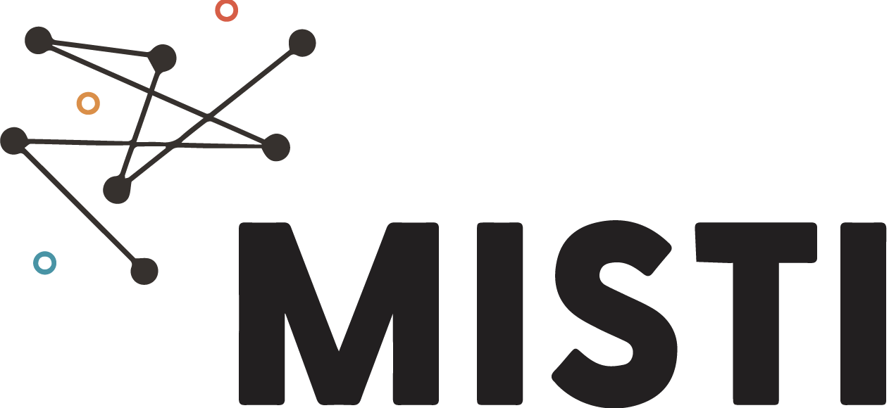
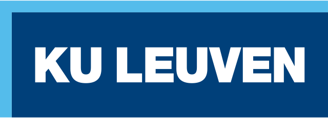

[Registration](#registration){: .btn .btn-primary .d-lg-inline-block my-lg-0 .mt-1}
[Important dates](#important-dates){: .btn .btn-primary .d-lg-inline-block my-lg-0 my-2 mx-lg-2 .mt-1}
[Organizers](#organizers){: .btn .btn-primary .d-lg-inline-block my-lg-0 my-2 mx-lg-2 .mt-1}
[Contact](#contact){: .btn .btn-primary .d-lg-inline-block my-lg-0 .mt-1} 
 
[Program](#program){: .btn .btn-primary .d-lg-inline-block my-lg-0 .mt-1}
[Venue](#venue){: .btn .btn-primary .d-lg-inline-block my-lg-0 my-2 mx-lg-2 .mt-1}
[Relevant repositories](#relevant-repositories){: .btn .btn-primary .d-lg-inline-block my-lg-0 .mt-1}

<!-- 

    <a href="#registration" type="button" class="btn btn-primary d-lg-inline-block my-lg-0" target="_blank">Registration</a>
    <a href="#important-dates" type="button" class="btn btn-primary d-lg-inline-block my-lg-0 my-2 mx-lg-2" target="_blank">Important dates</a>
    <a href="#organizers" type="button" class="btn btn-primary d-lg-inline-block my-lg-0 my-2 mx-lg-2" target="_blank">Organizers</a>
    <a href="#program" type="button" class="btn btn-primary d-lg-inline-block my-lg-0 my-2 mx-lg-2" target="_blank">Program</a>
    <a href="#venue" type="button" class="btn btn-primary d-lg-inline-block my-lg-0 my-2 mx-lg-2" target="_blank">Venue</a>
    <a href="#relevant-repositories" type="button" class="btn btn-primary d-lg-inline-block my-lg-0 my-2 mx-lg-2" target="_blank">Relevant repositories</a>
    <a href="#contact" type="button" class="btn btn-primary d-lg-inline-block my-lg-0" target="_blank">Contact</a>

 -->

***

### Overview

In this workshop, participants will engage in hands-on exploration of optimal control problems (OCPs) applied to motion planning and model predictive control (MPC) in autonomous robotic systems. By engaging with cutting-edge tools and techniques, participants will develop the skills necessary to navigate complex environments, optimize trajectory paths, and execute tasks with precision and efficiency in robotic systems.

To streamline the guided exercises, the workshop makes use of the free and open-source [Rockit](https://gitlab.kuleuven.be/meco-software/rockit) [1] and [Impact](https://gitlab.kuleuven.be/meco-software/impact) [2][3] software frameworks developed by the [MECO Research Team](https://www.mech.kuleuven.be/en/pma/research/meco) at KU Leuven and built on top of the numerical optimization framework [CasADi](https://github.com/casadi/casadi) [4], designed for efficient nonlinear programming. 

Exercises will be mainly in Python, and Docker images containing a development and simulation environment will be provided. Attendees can later adopt the presented open-source software frameworks in their research.

While foundational concepts of OCPs will be introduced, the course focuses on learning-by-doing. The course prioritizes practical know-how, enabling participants to directly apply Rockit and Impact to tackle real-world robotic challenges. The attendees will learn to formulate and solve OCPs, gaining valuable experience in implementing trajectory optimization algorithms and MPC strategies. Moreover, participants will learn **how to swiftly deploy OCPs and MPCs in C, Python and ROS 2**.

This workshop is organized by members of the [MECO Research Team](https://www.mech.kuleuven.be/en/pma/research/meco) of KU Leuven, Belgium. The MECO Research Team focusses on modeling, estimation, identification, analysis and optimal control of motion and motion systems such as mechatronic systems or machine tools. It combines theoretical contributions (development of design methodologies) with experimental knowhow (implementation and experimental validation on lab-scale as well as industrial setups). The theoretical research benefits from the group's expertise on numerical optimization, especially convex optimization. 

The following videos show previous works developed by the MECO Research Team using the software tools that will be used in this workshop:







This workshop has received funding from the *MIT-Belgium - KU Leuven Seed Fund* within the framework of the *MIT International Science and Technology Initiatives (MISTI)* grant programme.

  

    

        <figure>
            
        </figure>
    

    

        <figure>
            
        </figure>
    

    

        <figure>
            
        </figure>
    

  

***

### Registration

Due to capacity constraints at the venue of the workshop, we kindly ask all participants to register their participation. 

**Participation at the workshop is free of charge, but registration is compulsory**, and **limited to staff/students/researchers/professors/others associated to MIT or KU Leuven**. Please contact the organizers in case you have any question.

**Lunch will be provided during the two days of the workshop**.

Use the following button to register:

<a href="https://forms.office.com/e/uEVeKAjS2k" type="button" class="btn btn-primary d-lg-inline-block my-lg-0" target="_blank">Click here to register for the workshop</a>

**Your registration will be completed only after you receive a confirmation email from the organizers.**

***

### Important dates

- Registration deadline: July 12th, 2024 (AoE)
- Workshop dates: July 16th and 17th, 2024.

***

### Organizers

This workshop is organized (and its content has been created) by five members of the MECO Research Team of KU Leuven, Belgium: 

[Alejandro Astudillo](https://www.mech.kuleuven.be/en/pma/research/meco/people/00124760)  
Postdoctoral researcher

[Wilm Decré](https://www.mech.kuleuven.be/en/pma/research/meco/people/00052672)  
Research manager

[Louis Callens](https://www.mech.kuleuven.be/en/pma/research/meco/people/00143705)  
Doctoral researcher

[Alex Gonzalez García](https://www.mech.kuleuven.be/en/pma/research/meco/people/00159546)  
Doctoral researcher

[Dries Dirckx](https://www.mech.kuleuven.be/en/pma/research/meco/people/00110021)  
Doctoral researcher

***

### Contact

You can reach the organizers for any questions by contacting them at:

    alejandro.astudillovigoya < at > kuleuven.be

*** 

### Relevant repositories
